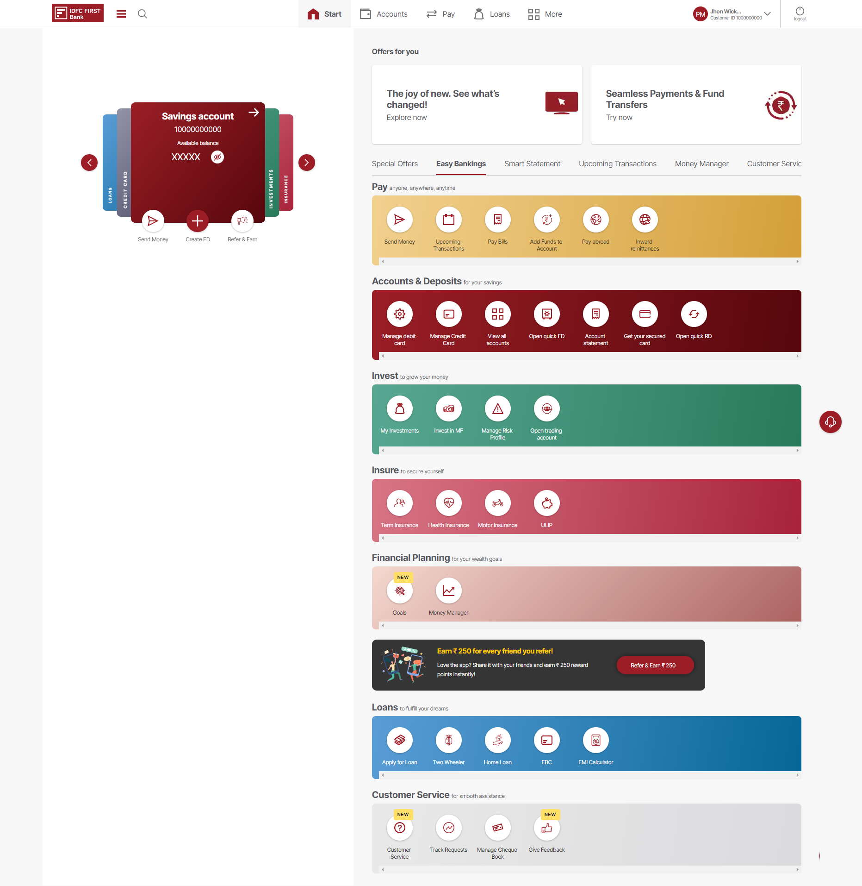
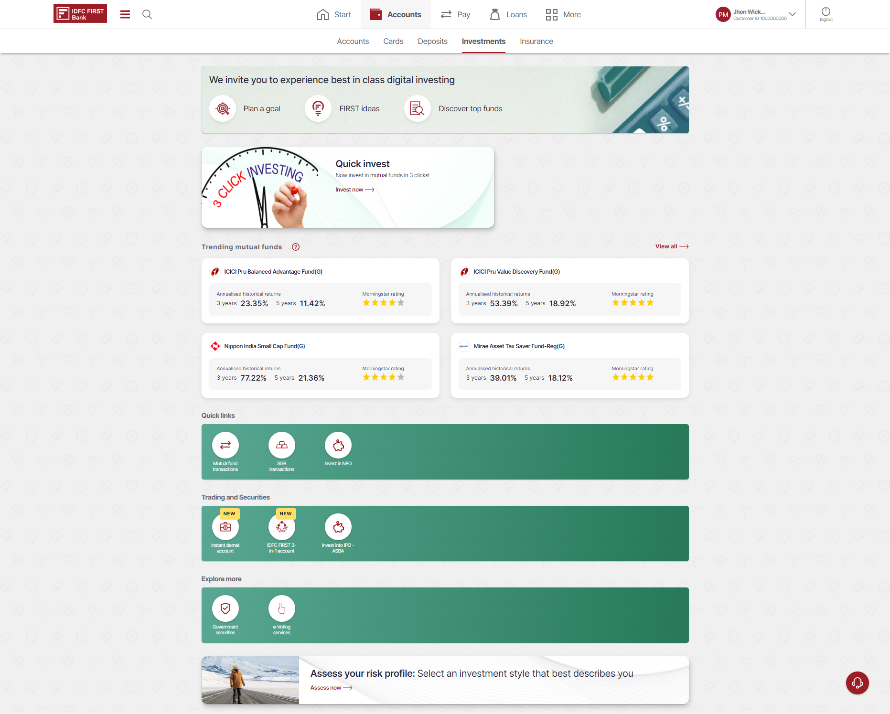
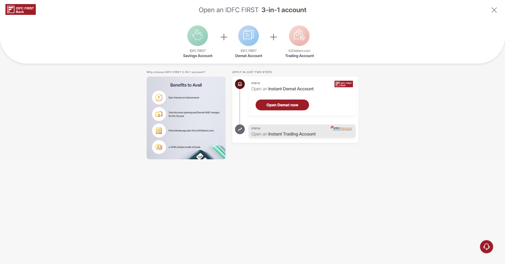
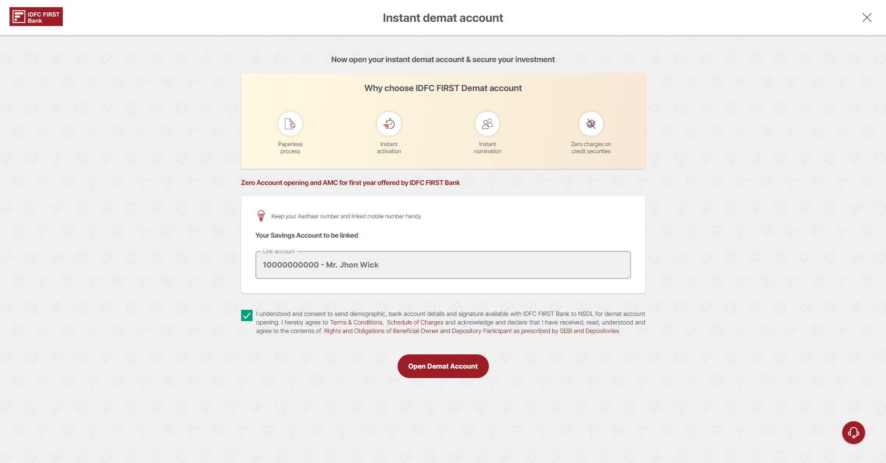
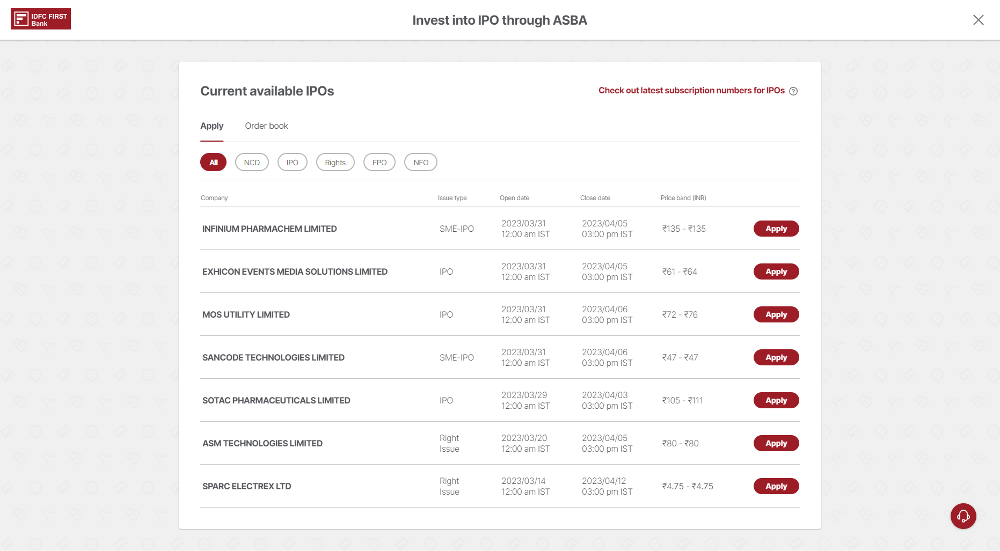

## IDFC Netbanking Portal - Demat and ASBA Squad

### Role: Frontend Developer

---

### Overview (TL;DR)

I worked as a frontend developer on the IDFC netbanking portal's Demat and ASBA squad. Our team consisted of project managers, developers, testers, and frontend developers. I was responsible for implementing designs using React and the context API, and achieving nearly 100% test coverage. I also helped colleagues write test cases to improve coverage. The project involved implementing a new feature or improving old feature and revamping the user interface to improve user experience. Our team attended daily scrum calls and end-of-sprint retrospective meetings. We achieved the goal in revenue by attracting more customer.

---

### Objective:

- Develop a netbanking portal for IDFC that would provide customers with a seamless and secure banking experience. The Demat and ASBA squad was responsible for the development of the demat account and ASBA (Application Supported by Blocked Amount) module of the portal.

- Implement new features and revamp existing designs while ensuring consistency and intuitive user experience.

- Achieve high test coverage to ensure the module's quality.

---

### Roles & Responsibilities:

- Implement provided designs into the frontend using React.

- Collaborate with other developers to ensure compatibility and consistency.

- Achieve high test coverage through test case writing and execution.

- Communicating technical issues to non-technical stakeholders in a clear and concise manner.

- Attend daily scrum calls and sprint retrospectives.

---

### Technologies & Tools used:

- React with Context API for frontend with custom IDFC's component library

- Feature switch

- GoCD

- Mac OS with Visual Code Studio

- Go (backend)

---

### Challenges:

- Working with a proprietary component library similar to MUI.

- Learning how to write test cases for better coverage and helping team members do the same.

- Using feature switch to gain control over feature release.

- Revamp of the old design while maintaining consistent user experience.

---

### Outcome:

- Contributed to the successful implementation of the Demat and ASBA squad's module for the IDFC netbanking portal.

- Achieved nearly 100% test coverage for the project.

- Contributed to the team's achievement of reaching 1 crore rupees mark for this specific module.

---

### Screenshots:

